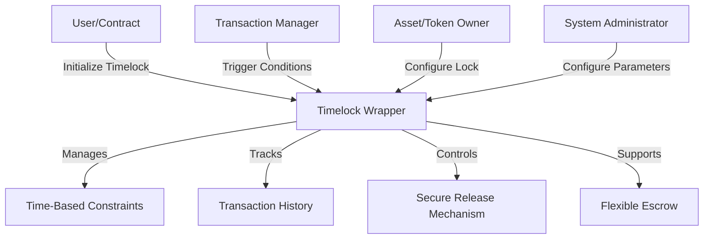

# High-Performance Timelock Wrapper

A robust and efficient Clarity smart contract providing advanced timelock and asset management capabilities for secure, performant blockchain interactions.

## Overview

High-Performance Timelock Wrapper enables developers to create sophisticated, secure blockchain interactions with advanced timelock mechanisms. The project provides:

- High-performance timelock management
- Secure asset transfer capabilities
- Flexible escrow and ownership transfer
- Configurable time-based constraints
- Comprehensive transaction tracking
- Efficient blockchain interaction patterns

## Architecture

The system is built around a main contract that handles all core functionality for asset tokenization and trading.



### Core Components

1. **Time Constraint Engine**: Manages complex timelock rules
2. **Transaction Interceptor**: Controls asset/token release
3. **Secure Escrow Mechanism**: Provides flexible holding patterns
4. **Audit Trail**: Tracks all timelock-related events
5. **Configurable Release Conditions**: Supports multiple unlock strategies

## Contract Documentation

### Main Contract: timelock-high-performance-wrapper.clar

The core contract provides advanced timelock management:

#### Key Features

- Flexible time-based asset/token locking
- Configurable release conditions
- Secure transaction interception
- Comprehensive event tracking
- Minimal gas overhead
- Support for complex escrow patterns

#### Access Control

- System Administrator: Configures global parameters
- Asset/Token Owners: Define specific timelock rules
- Transaction Managers: Trigger conditional releases
- Auditors: Monitor timelock events and history

## Getting Started

### Prerequisites

- Clarinet
- Stacks wallet
- STX tokens for transactions

### Basic Usage

1. **Initialize Timelock**:
```clarity
(contract-call? .timelock-high-performance-wrapper initialize-timelock 
    asset-id 
    lock-duration 
    release-conditions 
    lock-type)
```

2. **Configure Release Condition**:
```clarity
(contract-call? .timelock-high-performance-wrapper set-release-condition 
    asset-id 
    condition-type 
    condition-params)
```

3. **Request Asset/Token Release**:
```clarity
(contract-call? .timelock-high-performance-wrapper request-release 
    asset-id 
    requester)
```

## Function Reference

### Timelock Management

```clarity
(initialize-timelock asset-id duration conditions lock-type)
(set-release-condition asset-id condition-type params)
(request-release asset-id requester)
(force-release asset-id admin-key)
```

### Escrow Functions

```clarity
(create-timelock-escrow asset-id recipient lock-params)
(verify-escrow-release escrow-id)
(cancel-timelock-escrow escrow-id)
```

### Monitoring Functions

```clarity
(get-lock-status asset-id)
(get-release-history asset-id)
(check-release-eligibility asset-id requester)
```

## Development

### Testing

1. Clone the repository
2. Install Clarinet
3. Run tests:
```bash
clarinet test
```

### Local Development

1. Start Clarinet console:
```bash
clarinet console
```

2. Deploy contract:
```bash
clarinet deploy
```

## Security Considerations

### Asset Verification
- Only authorized verifiers can validate assets
- Verification status is permanent and immutable

### Trading Safety
- All trades use escrow for security
- Automatic fee and royalty calculations
- Built-in expiration for escrow transactions

### Ownership Protection
- Strict ownership checks
- Asset locking during escrow
- Prevention of double-spending shares

### Limitations
- Maximum of 1,000,000 shares per asset
- Maximum 50% royalty rate
- No direct STX refunds
- Locked assets cannot be transferred or modified